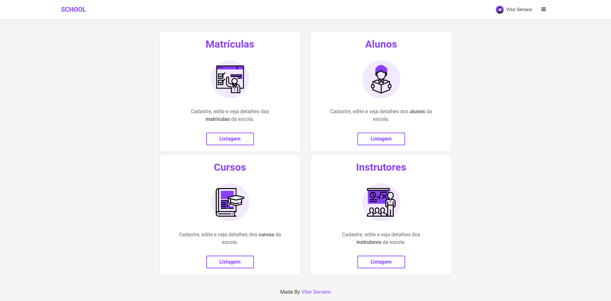
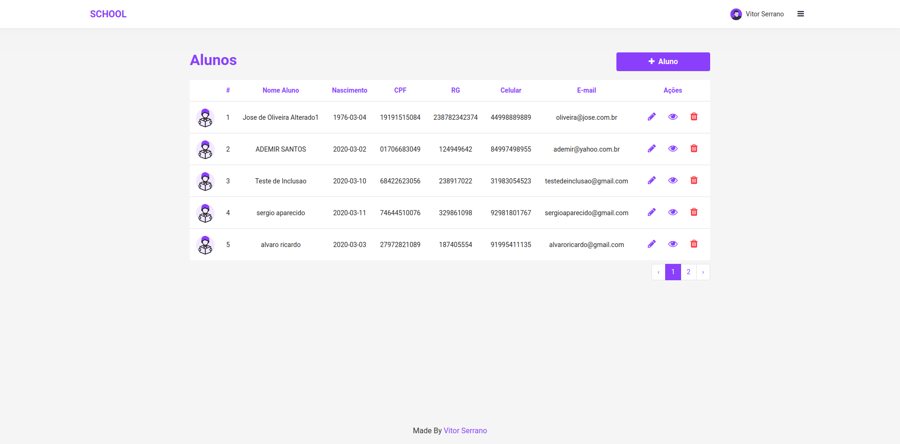
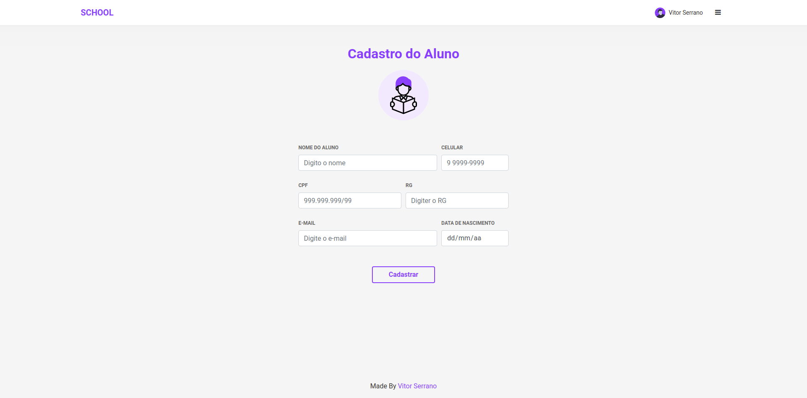

<h1 align="center">
    SCHOOL
</h1>

### :page_with_curl: Projeto
- Projeto realizado a partir de um trabalho da faculdade.

### :page_with_curl: Funcionalidades
- Autenticação para Login,
- Criação de Matrículas, Alunos, Cursos, Instrutores e Usuários.
- Visualização de Detalhes de Matrículas, Alunos, Cursos e Instrutores.
- Atualização de Matrículas, Alunos, Cursos e Instrutores.
- Remoção de Matrículas, Alunos, Cursos e Instrutores.

### :heavy_check_mark: Login
<h1 align="center">
    
</h1>

### :heavy_check_mark: Register
<h1 align="center">
    
</h1>

### :heavy_check_mark: Home
<h1 align="center">
    
</h1>

### :heavy_check_mark: Listagem
<h1 align="center">
    
</h1>

### :heavy_check_mark: Formulários

 O Formulário é utilizado para o method create, update e show.

<h1 align="center">
    
</h1>

### :page_facing_up: Login
1. `sudo composer require laravel/ui --dev`

2. `php artisan ui bootstrap`

3. `npm install && npm run dev`

4. `php artisan ui bootstrap --auth`

5. `npm install && npm run dev`

### :page_facing_up: Anotações
1. `php artisan make:controller StudentController --resource`
- Irá criar o arquivo StudentController dentro de App\Http\Controller

2. `php artisan make:model Models\\ModelStudent -m `
- Este comando irá criar uma pasta "Models" e dentro um arquivo "ModelStudent" 
- Também irá criar a migration com o comando `-m`

3. `php artisan serve` - Executa o projeto

4. `php artisan migration` - Cria as migrations

### :x: Erro durante o desenvolvimento
- Erro ao executar "php artisan migration"
- Foi executado este comando: `sudo apt-get install php5.6-mysql/php7.2-mysql` (Linuxs)

